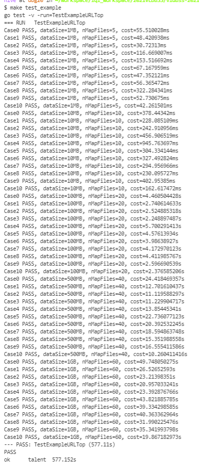
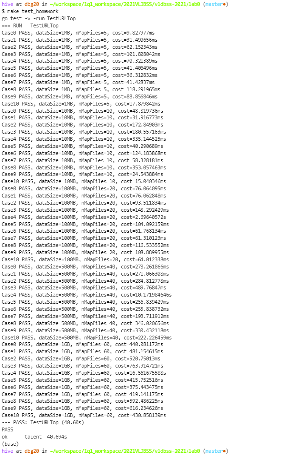

# Lab0 实验报告

## 实验结果

### 1. 完成 Map-Reduce 框架

`make test_example` 的实验截图

### 2. 基于 Map-Reduce 框架编写 Map-Reduce 函数

`make test_homework` 的实验截图

## 实验总结

我用了4天的时间完成了这次的实验，现在回头看任并不是很难，但我也遇到了比较多的困难。比较大的一个困难是我在实现mapreduce.go中worker()函数中的reduce pahse功能时，对于调用的map、reduce函数应该传入怎样的参数没有完全理解。我最开始没法工作的实现是一个reducer把从map的结果中读取的数据全部传入reduce函数，这种实现误打误撞实现了case0-1MB-5,但剩下的测试都没法通过。在思考无果后，我跟同学讨论了一下，最后会又看了一遍mit课程中对于mapreduce的介绍，才意识到自己理解的错误，修改之后实现了worker()函数中reduce phase的功能。

完成任务一后，对于实现更高效的URLTop代码，我也思考了很久，最后想出两方面的改进。一方面是urlcount的map phase仅对输入的数据进行分行操作，urlcount的reduce phase又会读取map phase的结果进行读取分行计数，这实际上在做了重复的工作，而在测试中，这一工作的耗时很长，因此我把count的功能在urlcount的map phase的map函数中实现，从而减去了重复工作。除此之外，这样修改还使重复的url只会写入一次文件，大大减少了文件读写的cost。另一方面，我利用分治的方法，在urltop的map phase的map函数中对于部分结果提前排序,使urltop的map phase的map函数只返回读取的文件中出现次数前十的url，从而减少了文件读写以及总的排序次数。两个优化分别将运行时间从577s缩减到50s,50s缩减到40s。

Map-Reduce 作为一个计算框架，运行逻辑的通用性非常重要。在通用性的情况下，使用者又可以通过设计高效的map、reduce函数提高计算效率，在通用和高效两方面取得了很好的平衡。